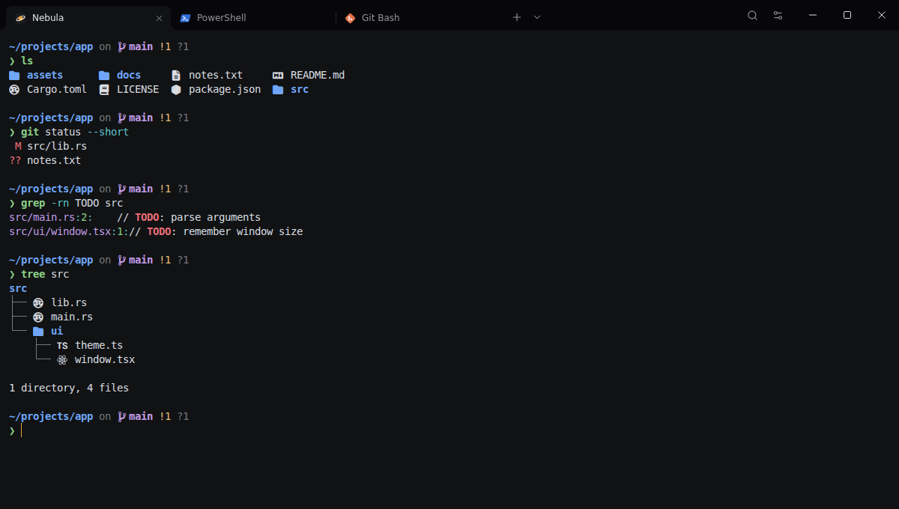

# Nebula Terminal

[](https://github.com/awizzz/nebula-terminal/actions/workflows/ci.yml)
[](https://github.com/awizzz/nebula-terminal/actions/workflows/security.yml)
[](LICENSE)

A terminal for Windows with Linux commands built in. Tabs, split panes, a command palette and a settings screen you can actually click through. It opens **Nebula**, its own command interpreter, by default, and runs PowerShell, Command Prompt, Git Bash and WSL too.

Website and download: [nebula.awizz.space](https://nebula.awizz.space)



## Install

Download the latest installer from [Releases](https://github.com/awizzz/nebula-terminal/releases/latest):

- `Nebula.Terminal_<version>_x64-setup.exe`: per-user installer (recommended)
- `Nebula.Terminal_<version>_x64_en-US.msi`: MSI for managed machines
- `Nebula-Terminal-<version>-windows-x64-portable.zip`: no installation, just unzip and run

Releases are not code-signed yet, so Windows SmartScreen may warn you the first time. Check the file against `SHA256SUMS.txt` from the same release before you continue:

```powershell
Get-FileHash '.\Nebula.Terminal_1.2.0_x64-setup.exe' -Algorithm SHA256
```

With [Scoop](https://scoop.sh), which installs the portable version and adds the `nebula-terminal` command. `scoop update nebula-terminal` follows new releases:

```powershell
scoop install https://github.com/awizzz/nebula-terminal/releases/latest/download/nebula-terminal.json
```

Requires Windows 10 1809 or later (ConPTY) and the WebView2 runtime, which ships with Windows 11 and current Windows 10 builds.

## Nebula, the built-in interpreter

If you know Linux, you already know Nebula. `ls`, `cd`, `cat`, `cp`, `mv`, `rm`, `grep`, `find`, `sed`, `awk`, `diff`, `head`, `tail`, `sort`, `wc`, `tree`, `ps`, `kill` and about 70 more commands work on Windows with the options you're used to. Windows programs like `git`, `node`, `python` or `code` run as usual.

```text
~/projects/app on  main !1 ?1
❯ grep -rn TODO src | head -5
```

- **The real GNU behaviour.** The core commands come from [uutils coreutils](https://github.com/uutils/coreutils), a faithful MIT-licensed rewrite of GNU coreutils, and `sed`, `diff` and `cmp` from the uutils [sed](https://github.com/uutils/sed) and [diffutils](https://github.com/uutils/diffutils). `grep`, `find`, `tree`, `ps`, `kill`, `xargs` and `open` are written for Nebula.
- **A real `awk`.** The POSIX language (patterns, fields, arrays, functions, `printf`, `getline`, pipes to and from commands) and the gawk functions people reach for: `gensub`, `strftime`, `asort`, `match` with groups. It was checked line by line against GNU awk.
- **Shell syntax you expect.** Pipes, `&&`, `||`, `;`, redirections (`>`, `>>`, `2>&1`, `&>`, here-documents), `$VAR`, `export`, `$(…)`, `~`, `*.txt`, `{a,b}` and `{1..10}`, aliases, `!!` and `!$`. `/c/Users` and `/dev/null` work too.
- **Real scripts.** `if`, `for`, `while`, `case`, functions with `local` variables, arrays and associative arrays, `$((…))`, `[[ … ]]`, `read`, `mapfile`, `${name%.txt}` and the other `${…}` forms, `set -e`, `trap`. Run a script with `nebula-sh deploy.sh` or `./deploy.sh`.
- **Background jobs.** `cmd &` runs while you keep typing; `jobs`, `wait`, `fg` and `kill %1` handle them. A job can't take the keyboard, and Ctrl+C only stops what runs in front.
- **Nicer than a plain prompt.** It shows the folder, Git branch and changes, how long slow commands took, and failed exit codes. Commands are colored as you type (green if they exist, red if not), suggestions from your history appear in grey (→ to accept).
- **Tab completion that knows things.** Commands and paths, the options of every Nebula command (`ls --<Tab>`), Git subcommands and branches, `$VARIABLES` and your SSH hosts.
- **`ls` and `tree` with icons and colors** on screen. When the output goes to a file or another command, it stays plain.
- **Helpful errors.** Typing `gti` suggests `git`, and `dir`, `cls` or `findstr` point to `ls`, `clear` and `grep`.

Your history is saved in `%APPDATA%\Nebula\history.txt`. Aliases and variables can go in `~/.nebularc`, which runs at startup:

```sh
alias gs='git status'
export EDITOR=code
```

`nebula-sh.exe` also works on its own in Windows Terminal or any other terminal. Set `NEBULA_ICONS=1` there if your font includes Nerd Font icons.

A short script, to give an idea:

```sh
#!/usr/bin/env nebula
set -e
for file in *.log; do
  size=$(wc -c < "$file")
  if (( size > 1000000 )); then
    echo "${file%.log} is $(( size / 1024 )) KB"
  fi
done
```

Not supported yet: `getopts`, `**` globs, and pausing a job with Ctrl+Z. For scripts that need them, use Git Bash or WSL.

## What you get

- **Your shells, detected automatically.** Nebula, PowerShell 7, Windows PowerShell, Command Prompt, Git Bash and WSL, plus one entry for each WSL distribution and for each host in your `~/.ssh/config`. Nebula is the default, and you can pick another in Settings.
- **Your own profiles.** Settings → Profiles runs any program in a tab, with its own arguments, starting folder and color. You see how the arguments will be split before you save.
- **Tabs and split panes.** Drag tabs to reorder them, middle-click to close, and right-click for more. Double-click a tab to rename it, and give it a color from its right-click menu. Split any pane right or down, up to eight panes per tab, and drag the dividers to resize them.
- **Command palette** (`Ctrl+Shift+P`). Every action, shell and theme in one searchable list.
- **Nine themes**, including light ones. The window chrome follows the terminal colors, so a light theme gives you a light app. You can also pick an accent color, a Mica, solid or image background, and adjust transparency.
- **Settings without a config file.** Fonts, cursor, padding, scrollback, profiles, starting folder and shortcuts. Every change applies immediately.
- **Safe paste.** Pasting several lines shows exactly what will run before it reaches the shell, and a single pasted line never runs on its own.
- **Shell integration, built in.** PowerShell, Git Bash and WSL (bash) mark their commands and report their folder without any setup, so notifications, command jumps and new tabs in the current folder work there as they do in Nebula. Your own profile and startup files still run.
- **Knows when you're done.** When a long command finishes in a tab you're not looking at, you get a Windows notification and a green or red dot on the tab.
- **Updates itself.** When a new version is out, the app offers to install it and restarts. You can also check from Settings → About.
- **Opens from Explorer and from any shell.** Right-click a folder and choose Open in Nebula Terminal, or type `nebula-terminal .` in cmd, PowerShell, Git Bash or WSL. Both open a tab in the window you already have.
- **Your default terminal, if you want.** On Windows 11, Settings → Behavior makes Nebula Terminal the default terminal: `cmd`, scripts and other console programs started from the Start menu or Explorer open in a tab.
- **Windows habits.** `Ctrl+C` copies when text is selected and interrupts otherwise, `Ctrl+V` pastes, and dropping files inserts their quoted paths.
- **Jump between commands.** `Ctrl+↑` and `Ctrl+↓` scroll from one prompt to the next, a click on a prompt selects that command's output, and failed commands leave a red mark by the scrollbar. Copy last command output is in the palette and the right-click menu.
- **Opens where you are.** New tabs and splits start in the folder of the shell you're in. Otherwise shells start in your user folder, or your Desktop, Documents or any folder you pick.
- **Picks up where you left off.** Your tabs, their names and colors, your splits and the folder each one was in are restored on launch. The shells themselves start fresh.

## Keyboard shortcuts

| Action | Shortcut |
| --- | --- |
| New tab | `Ctrl+Shift+T` |
| Close tab | `Ctrl+Shift+W` |
| Next / previous tab | `Ctrl+Tab` / `Ctrl+Shift+Tab` |
| Go to tab 1–9 | `Ctrl+Alt+1` … `Ctrl+Alt+9` |
| Split right / down | `Ctrl+Shift+D` / `Ctrl+Shift+E` |
| Move to the pane left, right, above or below | `Alt+Arrow` |
| Close pane | `Ctrl+Shift+Q` |
| Find | `Ctrl+Shift+F` |
| Previous / next command | `Ctrl+↑` / `Ctrl+↓` |
| Command palette | `Ctrl+Shift+P` |
| Settings | `Ctrl+,` |
| Zoom in / out / reset | `Ctrl+=` / `Ctrl+-` / `Ctrl+0` (or `Ctrl+Wheel`) |
| Open a link | `Ctrl+Click` |

All of these except the last three rows can be changed in **Settings → Keyboard**. The recorder warns you when two actions share a shortcut.

## What's next

Next up: a winget package, signed releases, a Quake-style drop-down window, `sed` and `awk` in Nebula, and more. See the [roadmap](docs/roadmap.md), and open an issue for anything you'd like to see.

## Build from source

You need Node.js 24, Rust 1.98.1 (pinned in `rust-toolchain.toml`), the MSVC build tools and WebView2.

```powershell
git clone https://github.com/awizzz/nebula-terminal.git
cd nebula-terminal
npm ci
npm run tauri dev      # builds the Nebula interpreter, then runs the app with hot reload
npm run tauri build    # build the installers into src-tauri/target/release/bundle
```

`npm run dev` opens the interface in a browser with a fake session. That's handy for UI work, but no shell runs there.

See [CONTRIBUTING.md](CONTRIBUTING.md) for the checks CI runs and [docs/architecture.md](docs/architecture.md) for how the code is organized.

## License

[PolyForm Shield 1.0.0](LICENSE). Use Nebula Terminal for anything, including at work, read the code and send pull requests; just don't use the code to build a product that competes with it. Versions up to 1.1.0 were released under the MIT License and stay under it.

Nebula ships [uutils coreutils](https://github.com/uutils/coreutils) and [sed](https://github.com/uutils/sed) (MIT), [uutils diffutils](https://github.com/uutils/diffutils) (MIT or Apache 2.0) and icons from [Nerd Fonts](https://www.nerdfonts.com) (MIT, see `src/assets/fonts/LICENSE-nerd-fonts.txt`).
